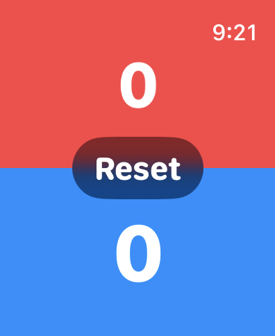
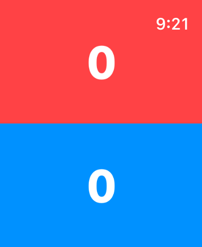

# ScoreCounter

A minimal two-player score counter for Apple Watch, built with SwiftUI.

The screen is split into two colored halves — red on top, blue on bottom — one for each player or team. Perfect for keeping score in table tennis, badminton, board games, or any head-to-head match right from your wrist.

## Features

- **Tap to score** — tap a side to add a point for that player. The number briefly shrinks for tactile visual feedback.
- **Two-sided reset** — long-press (1 second) on *both* sides to reset both scores to zero. Requiring both sides prevents accidental resets mid-game; a "Reset" confirmation flashes on screen when it happens.
- **Reset timeout** — if only one side is held, the reset request quietly expires after 5 seconds.
- **Glanceable design** — large rounded numerals on bold color fields, readable at arm's length with no menus or extra taps.

## How to use
<p align="left">



<p>
| Action | Result |
|---|---|
| Tap red or blue side | +1 point for that side |
| Hold both sides for 1 second | Reset both scores to 0 |

## Requirements

- Xcode with watchOS SDK
- watchOS 26.2 or later
- Apple Watch or the watchOS Simulator

## Getting started

1. Clone the repository:
   ```sh
   git clone <repo-url>
   cd ScoreCounter
   ```
2. Open `ScoreCounter.xcodeproj` in Xcode.
3. Select the **ScoreCounter Watch App** scheme and a watchOS simulator (or a paired Apple Watch).
4. Build and run (`⌘R`).

## Project structure

```
ScoreCounter Watch App/
├── ScoreCounterApp.swift   # App entry point
├── ContentView.swift       # Score UI, tap/long-press gestures, reset logic
└── Assets.xcassets         # App icon and accent color
```

## License

No license specified.
